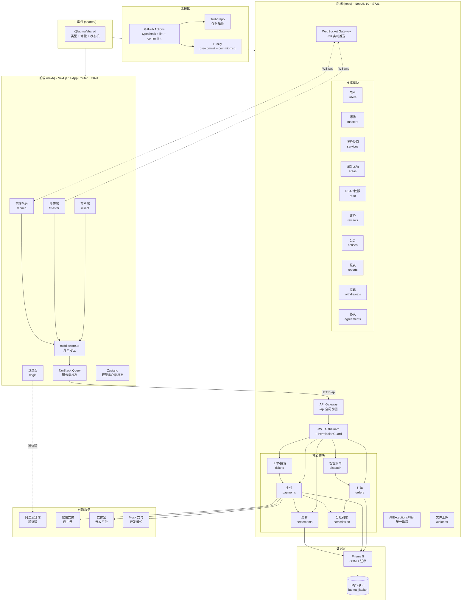
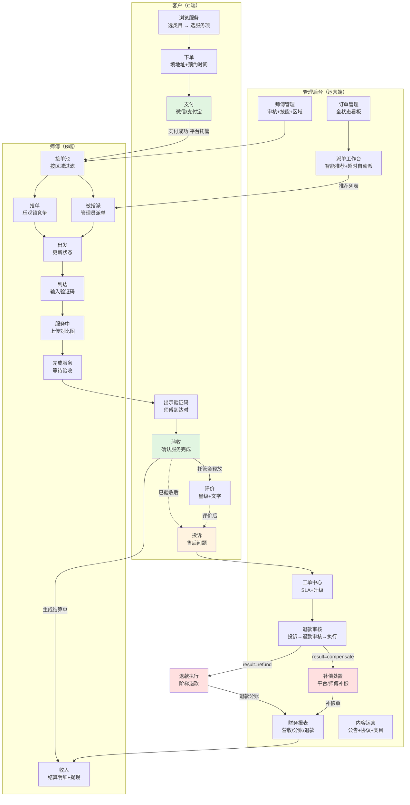
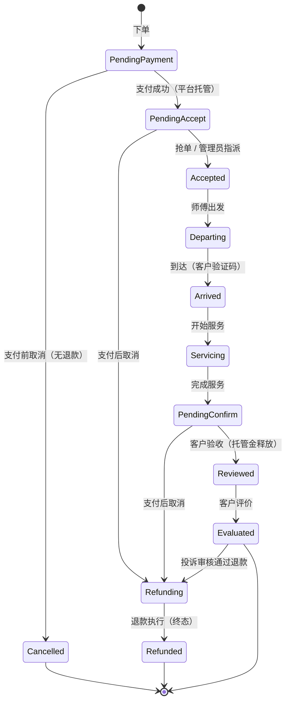
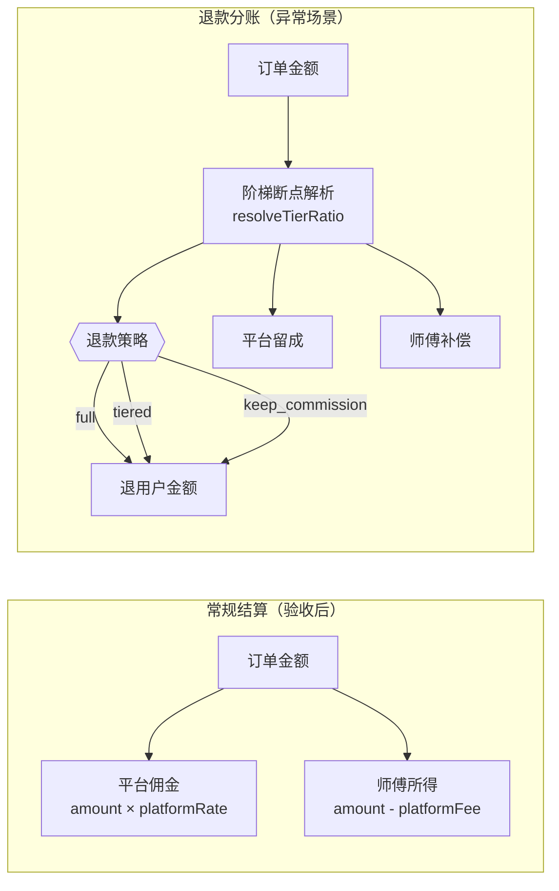
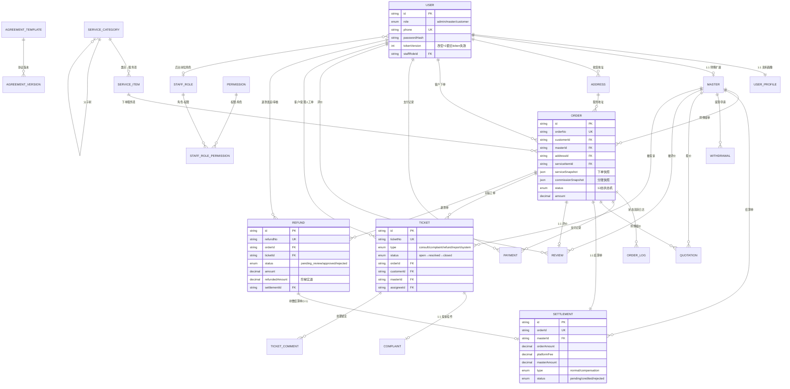

# 老马家电（laoma-jiadian）

家电上门服务平台——客户预约下单、师傅接单上门、平台托管结算的完整闭环系统。

## 架构全景图



## 业务全景图



### 订单状态机



### 分账规则



## 数据库表关系图

> 完整字段定义见 `nest/prisma/schema.prisma`，以下展示核心表的关联关系。



## 技术栈

| 分层 | 技术 | 目录 | 端口 |
|---|---|---|---|
| 前端 | Next.js 14（App Router）+ React 18 + Tailwind + TanStack Query + Zustand | `next/` | 3824 |
| 后端 | NestJS 10 + Prisma 5 + MySQL 8 + JWT + WebSocket | `nest/` | 3721 |
| 共享 | TypeScript 类型 / 常量 / 状态机（`@laoma/shared`） | `shared/` | — |

- 包管理：**pnpm 8 workspace** + **Turborepo 2**
- 全局 API 前缀：`/api`；后端静态资源：`/uploads`
- WebSocket 端点：`/ws`（JWT 握手鉴权 + 区域定向广播）

## 目录结构

```
home_app/
├─ package.json            # 根：统一 dev / build / typecheck / lint 入口
├─ turbo.json              # turbo 任务编排
├─ pnpm-workspace.yaml     # workspace 包声明
├─ .github/workflows/      # CI/CD：typecheck + lint + commitlint + 部署
├─ .husky/                 # Git hooks：pre-commit (lint) + commit-msg (commitlint)
├─ docs/                   # 全部业务设计与工程文档
│  ├─ engineering.md       # 工程化专项（E-01~E-14）
│  ├─ commit-convention.md # Git 提交规范
│  ├─ orders-sop.md        # 订单状态机与业务流程
│  ├─ dispatch-design.md   # 智能派单设计
│  ├─ refund-aftersale-design.md  # 退款/售后设计
│  ├─ complaints-tickets-design.md # 投诉/工单设计
│  ├─ rbac-design.md       # RBAC 权限设计
│  ├─ service-category-tree.md    # 三级服务类目
│  └─ HANDOFF.md           # 项目交接文档
├─ nest/                   # @laoma/backend  NestJS 后端
│  ├─ src/
│  │  ├─ orders/           # 订单（状态机+抢单+指派+取消）
│  │  ├─ payments/         # 支付（微信/支付宝/Mock + 退款）
│  │  ├─ settlements/      # 结算台账
│  │  ├─ commission/       # 分账引擎（三级降级 + 阶梯退款）
│  │  ├─ tickets/          # 工单/投诉（SLA + 升级）
│  │  ├─ gateway/          # WebSocket 实时推送
│  │  ├─ masters/          # 师傅管理
│  │  ├─ users/            # 用户管理
│  │  ├─ services/         # 服务类目
│  │  ├─ areas/            # 服务区域闸门
│  │  ├─ rbac/             # RBAC 权限守卫
│  │  ├─ reviews/          # 评价
│  │  ├─ reports/          # 运营报表
│  │  ├─ notices/          # 公告
│  │  ├─ withdrawals/      # 提现
│  │  ├─ agreements/       # 协议
│  │  ├─ auth/             # 认证（JWT + 验证码 + 密码）
│  │  ├─ common/           # 共享（装饰器/拦截器/过滤器）
│  │  └─ prisma/           # Prisma 服务
│  ├─ prisma/              # schema + 迁移 + seed
│  └─ jest.e2e.config.js   # E2E 测试配置
├─ next/                   # @laoma/frontend  Next.js 前端
│  └─ src/
│     ├─ app/
│     │  ├─ (auth)/        # 登录/注册
│     │  ├─ client/        # 客户端
│     │  ├─ master/        # 师傅端
│     │  └─ admin/         # 管理后台
│     ├─ components/       # 通用组件
│     └─ lib/              # API 封装/认证/路由守卫
└─ shared/                 # @laoma/shared  共享类型与常量
   └─ src/
      ├─ types.ts          # OrderStatus 枚举 + 状态机定义
      └─ index.ts          # 导出
```

## 角色与路由

前端三个角色独立路由前缀，登录前仅 `/login` 可访问，`next/src/middleware.ts` 做前置拦截：

| 角色 | 路由前缀 | 首页 | 核心能力 |
|---|---|---|---|
| 客户 | `/client` | `/client` | 浏览服务、下单支付、查看订单、验收评价、投诉 |
| 师傅 | `/master` | `/master` | 接单池、接单/出发/到达/服务、收入明细、提现 |
| 管理员 | `/admin` | `/admin` | 订单/派单/退款/师傅/财务/工单/公告/权限 |

白名单与拦截规则集中在 `next/src/lib/route-guards.ts`。

## 环境要求

- Node ≥ 18（推荐 20+）
- pnpm 8.15.4（见根 `package.json` 的 `packageManager`）
- MySQL 8.0+（需先安装并创建数据库）

## 快速开始

### 1. 准备数据库

安装 MySQL 8 后创建数据库：

```sql
CREATE DATABASE laoma_jiadian CHARACTER SET utf8mb4 COLLATE utf8mb4_unicode_ci;
```

### 2. 安装依赖

```bash
pnpm install
```

### 3. 配置环境变量

```bash
cp nest/.env.example nest/.env    # 后端配置
cp next/.env.example next/.env.local  # 前端配置（开发环境可全留默认）
```

编辑 `nest/.env`，至少修改 `DATABASE_URL`（改为你的 MySQL 连接串）。其余变量按注释说明按需配置。

### 4. 初始化数据库

```bash
pnpm prisma:generate   # 生成 Prisma Client
pnpm prisma:migrate    # 执行迁移建表
pnpm --filter @laoma/backend seed   # 写入种子数据（角色/权限/类目/区域）
```

### 5. 启动开发服务

```bash
pnpm dev    # turbo run dev，并行启动前端(:3824) + 后端(:3721)
```

- 前端：http://localhost:3824
- 后端 API：http://localhost:3721/api/v1
- Swagger 文档：http://localhost:3721/api/docs

### 6. 类型检查 / 生产构建

```bash
pnpm typecheck   # 两端 tsc --noEmit
pnpm build       # 两端分别 build
```

## 常见问题

| 问题 | 解决方案 |
|------|----------|
| `EADDRINUSE: address already in use :::3721` | 端口被占：`netstat -ano \| findstr 3721` 找 PID，`taskkill /PID <pid> /F` 释放 |
| `Can't reach database server` | 检查 MySQL 是否启动、`DATABASE_URL` 中的端口/密码是否正确 |
| `prisma generate` 报类型找不到 | 确保先 `pnpm prisma:generate` 再跑 typecheck |
| 前端登录成功但不跳转 | `next/.env.local` 不要设 `NEXT_PUBLIC_API_BASE`，留空让自动解析 host |
| Swagger 页面 404 | 开发环境访问 `localhost:3721/api/docs`（不是 `/docs`），生产通过 Nginx `/api/` 代理自动可达 |
| `pnpm install` 报 lockfile 过期 | CI 环境下 `CI=true` 会冻结锁文件，本地用 `pnpm install --no-frozen-lockfile` |

## 可用脚本

**根目录**

| 脚本 | 说明 |
|---|---|
| `pnpm dev` | 并行启动前后端开发服务 |
| `pnpm build` | 两端生产构建 |
| `pnpm typecheck` | 两端 TypeScript 类型检查 |
| `pnpm lint` | ESLint 检查（0 error） |
| `pnpm prisma:generate` | 生成 Prisma Client |
| `pnpm prisma:migrate` | 执行数据库迁移 |
| `pnpm prisma:studio` | Prisma Studio 数据库 GUI |

**后端 `nest/`**

| 脚本 | 说明 |
|---|---|
| `pnpm dev` | 热重载启动（`nest start --watch`） |
| `pnpm build` | 编译到 `dist/` |
| `pnpm start:prod` | 生产启动（`node dist/main`，需先 build） |
| `pnpm test` | 单元测试（P0 纯函数 + P1 金额守卫，195 tests） |
| `pnpm test:e2e` | E2E 测试（正向全链 + 售后链，16 tests） |
| `pnpm lint` | ESLint |
| `pnpm seed` | 写入种子数据 |

> `start`（非 `start:prod`）是开发式 runner，**勿用于生产部署**。

## 工程质量

| 维度 | 状态 | 说明 |
|---|---|---|
| TypeScript | tsc EXIT=0 | 三端 `strict: true`，零 `@ts-ignore` |
| `any` 治理 | 288→139（-52%） | 保留的为第三方 SDK / Prisma JSON / catch 块 |
| ESLint | 0 error / 90 warn | `no-explicit-any` warn 级 |
| 单元测试 | 10 suites / 195 tests | P0 纯函数 + P1 金额守卫 |
| E2E 测试 | 2 suites / 16 tests | 正向全链 + 售后链 |
| CI 门禁 | typecheck + lint + commitlint | 失败即阻断部署 |
| Git 规范 | commitlint + husky | Conventional Commits，本地 + CI 双重拦截 |

详见 `docs/engineering.md`（E-01 ~ E-14）。

## 文档索引

| 文档 | 内容 |
|---|---|
| `docs/HANDOFF.md` | 项目交接文档（全貌、工程纪律、已知坑） |
| `docs/engineering.md` | 工程化专项（CORS/CI/异常/Lint/测试/类型安全/提交规范） |
| `docs/commit-convention.md` | Git 提交规范（Conventional Commits + 工具链） |
| `docs/orders-sop.md` | 下单接单 SOP（状态机 + 端点 + 约束） |
| `docs/dispatch-design.md` | 智能派单（推荐算法 + 看板 + 超时自动派） |
| `docs/refund-aftersale-design.md` | 退款/售后审核（Refund 表 + 审核流） |
| `docs/complaints-tickets-design.md` | 投诉/工单（SLA + 升级 + 处置联动） |
| `docs/rbac-design.md` | RBAC 权限（四实体 + 权限码 + 预设角色） |
| `docs/service-category-tree.md` | 三级服务类目（4 板块 / 12 二级 / 37 三级） |
| `docs/WS_SUBSCRIPTION_PLAN.md` | WebSocket 订阅改造方案 |
